# OLR1+ Lipid-Associated TAMs Drive Immune Exclusion in MMRp Colorectal Cancer
### A Multi-Phase Single-Cell RNA-seq Study of the Colorectal Cancer Immune Microenvironment

**Author**: Yue Zhan · Department of Biostatistics, University of Nebraska Medical Center · yzhan@unmc.edu  
**Status**: Six-phase analysis complete (Phases 1–5 + supplementary)

---

## Overview

This project integrates five multi-institutional scRNA-seq cohorts (153,136 cells) to characterize the tumor microenvironment (TME) in microsatellite-stable (MMRp) colorectal cancer (CRC) versus ulcerative colitis (UC), identify suppressive pre-driver immune populations, dissect their intercellular communication with stromal cells, and validate clinical significance in independent bulk-RNA and matched scRNA-seq cohorts.

**Core narrative**: Chronic inflammation (UC) → CRC evolution drives **OLR1+ lipid-associated TAM** polarization at the tumor-stroma boundary. These TAMs form a positive-feedback crosstalk loop with **FAP+ myofibroblasts** via SPP1-ITGAV:ITGB1 and LGALS1-CD69/PTPRC signaling axes, creating a dual physical (ECM remodeling) and immune (T cell exclusion) barrier — the primary mechanism of MMRp CRC immune evasion.

---

## Integrated Mechanism Model

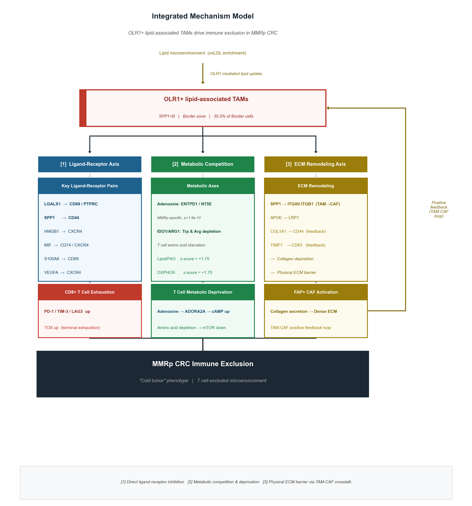

*OLR1+ lipid-associated TAMs drive immune exclusion through three convergent arms: (1) direct ligand-receptor inhibition of CD8+ T cells via LGALS1/SPP1/HMGB1, (2) metabolic competition through adenosine and amino acid depletion, and (3) ECM remodeling via TAM-CAF positive feedback. Together, they produce the "cold tumor" phenotype characteristic of MMRp CRC.*

---

## Study Design

| Phase | Focus | Key Method | Key Result |
|-------|-------|------------|------------|
| 1 | Multi-cohort integration & cell annotation | scVI / scANVI / CellAssign | 153,136 cells, 10 lineages, cLISI = 1.21 |
| 2 | TME characterization & trajectory | Palantir / decoupleR / SCENIC | OLR1+ TAMs: 75.5x CRC enrichment |
| 3 | Patient-level MMRp/MMRd stratification | Gated Attention-MIL (ABMIL) | AUC = 0.909, AUPRC = 0.922 |
| 4 | Cell communication & metabolic mechanism | LIANA / NicheNet / AUCell | SPP1-CD44 & LGALS1-CD69 as top axes |
| 5a | Anatomical sidedness validation | GSE188711 (scRNA-seq, n=26,218 cells) | Right-sided CRC: OLR1+ TAM enriched |
| 5b | Bulk cohort survival analysis | TCGA-COAD Cox regression (n=747) | Right-sided CRC: HR = 1.74, p = 0.001 |

---

## Datasets

| Dataset | Disease | Cells (post-QC) | Role |
|---------|---------|-----------------|------|
| GSE132465 | CRC | 54,487 | Primary discovery |
| GSE132257 | CRC | 15,642 | Primary discovery |
| cellxgene | CRC | 9,003 | Primary discovery |
| GSE125527 | UC | 71,866 | Disease comparison |
| GSE150115 | UC | 2,138 | Disease comparison |
| **Total (Phase 1-4)** | CRC + UC | **153,136** | Integration atlas |
| GSE178341 | CRC | 94,196 immune cells | MIL training |
| GSE144735 | CRC border cells | 9,424 | Mechanism dissection (Phase 4) |
| GSE188711 | Left/right CRC | 26,218 | Independent validation (Phase 5a) |
| TCGA-COAD | Bulk RNA-seq | 747 (OS data) | Survival validation (Phase 5b) |

QC filters: mitochondrial gene fraction <= 10%, Scrublet doublet removal.

---

## Phase 1 — Multi-Cohort Integration & Cell Type Annotation

**Goal**: Integrate five heterogeneous cohorts into a harmonized single-cell atlas while preserving biological variation.

**Methods**:
- Batch-aware HVG selection (3,000 genes)
- **scVI** (n_latent=30, n_layers=2, batch_key=`batch`, disease covariate; early stopping ~96 epochs)
- **scANVI** semi-supervised refinement (labels_key=`cellass_type`, max_epochs=50)
- Integration quality: scANVI cLISI=1.21 vs scVI cLISI=1.33 (k=90)
- **CellAssign** probabilistic marker-driven annotation -> 10 lineages

**Cell type composition (153,136 cells)**:

| Cell Type | Count | % |
|-----------|-------|---|
| T cells | 77,927 | 50.9% |
| Myeloid | 15,972 | 10.4% |
| B cells | 14,618 | 9.6% |
| Epithelial | 13,587 | 8.9% |
| Fibroblasts | 12,741 | 8.3% |
| NK cells | 8,923 | 5.8% |
| Endothelial | 5,203 | 3.4% |
| Plasma | 3,107 | 2.0% |
| Mast cells | 695 | 0.5% |
| pDC | 363 | 0.2% |

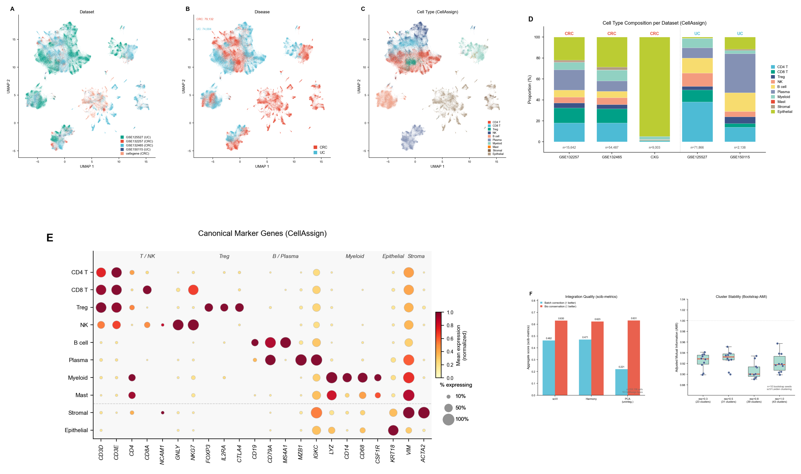

*Figure 1. (A-B) scVI/scANVI UMAP colored by cell type and disease condition. (C) Cell type composition across CRC and UC cohorts. (D) Canonical marker expression dotplot. (E-F) Integration quality metrics (iLISI / cLISI) across batches.*

---

## Phase 2 — TME Characterization & Pre-Driver Trajectory Analysis

**Goal**: Fine-annotate immune subpopulations, identify CRC-specific suppressive pre-driver populations, and reconstruct myeloid differentiation trajectories.

**Methods**:
- Fine annotation: 18 T cell subtypes (77,927 cells), 12 myeloid subtypes (15,972 cells)
- Differential abundance: Mann-Whitney U + BH FDR across CRC vs UC
- **Palantir** pseudotime trajectory reconstruction (Classical_Mono -> TAM)
- **decoupleR** TF activity scoring; **SCENIC** regulon analysis
- Spatial enrichment analysis at tumor-stroma border vs core

### 2A. Myeloid Trajectory

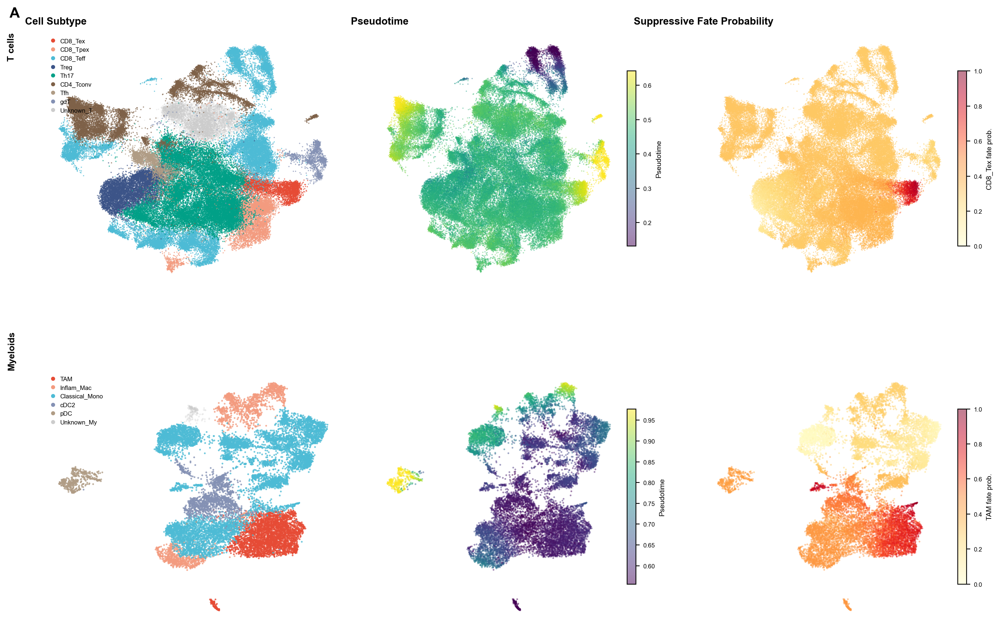

*Pseudotime analysis revealing the Classical_Mono -> Intermediate -> OLR1+ TAM differentiation trajectory.*


*Palantir pseudotime and entropy across myeloid differentiation states.*


*Differentially expressed genes along the OLR1+ TAM trajectory branch.*

### 2B. Spatial Distribution


*OLR1+ TAM enrichment at the tumor-stroma border vs tumor core (35.5% of border-zone myeloid cells).*


*Suppressive program scores by anatomical compartment and disease class.*


*Per-patient OLR1+ TAM proportion heatmap across CRC and UC samples.*

### 2C. SCENIC Regulon Analysis


*TF regulon activity heatmap across myeloid subtypes. PPARG, MAF, and BHLHE41 are top drivers of OLR1+ TAM fate.*


*TF regulon activity along pseudotime trajectory.*


*Key TF regulon activity projected onto myeloid UMAP.*

**Key findings**:
- OLR1+ lipid-associated TAMs (OLR1+ MMP9+ SPP1+) show **75.5x CRC enrichment** vs UC (BH-adjusted p < 0.001)
- CD8_Tex (exhausted T cells) co-enriched in CRC (13.8x)
- Palantir confirms Classical_Mono -> Intermediate -> OLR1+ TAM fate
- PPARG, MAF, BHLHE41 drive suppressive fate commitment; CIITA, NR4A1 lost

---

## Phase 3 — Attention-MIL Patient Stratification

**Goal**: Build a patient-level classifier to distinguish MMRp (immune-excluded) from MMRd (immune-inflamed) CRC using single-cell immune profiles.

**Methods**:
- **Gated Attention-MIL (ABMIL)** in PyTorch; each patient as a "bag" of immune cell embeddings
- Training: GSE178341 (62 patients, 94,196 cells); 5-fold stratified cross-validation
- Feature alignment via PCA on 766 shared HVGs for transfer to validation cohorts
- Augur-like per-cell-type predictability scoring

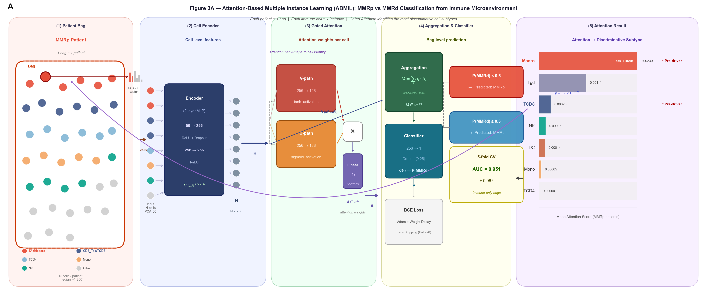

*Gated Attention-MIL architecture for patient-level MMRp vs MMRd classification.*

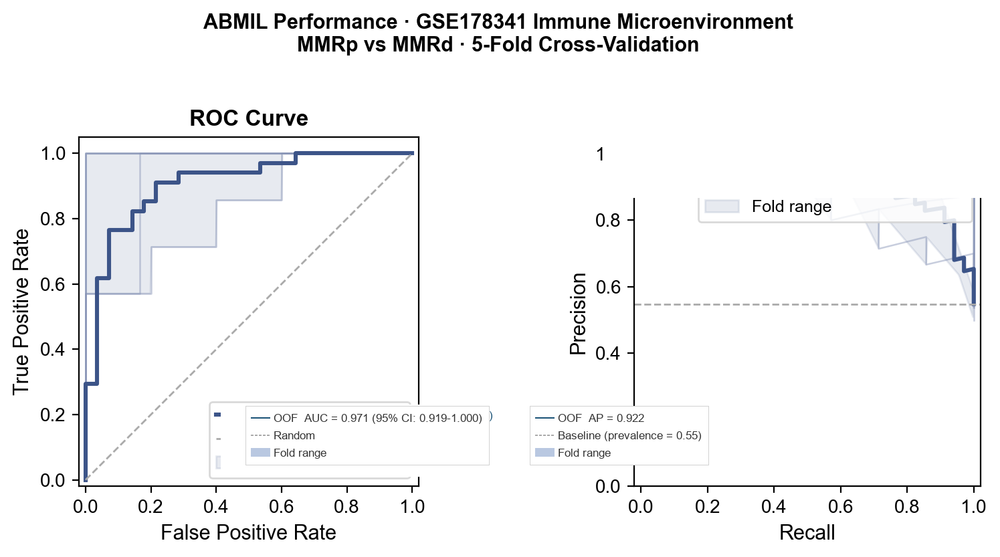

*ROC (OOF AUC = 0.909, mean fold AUC = 0.951, 95% CI: 0.858–1.000) and precision-recall (AUPRC = 0.922) curves across 5-fold cross-validation.*

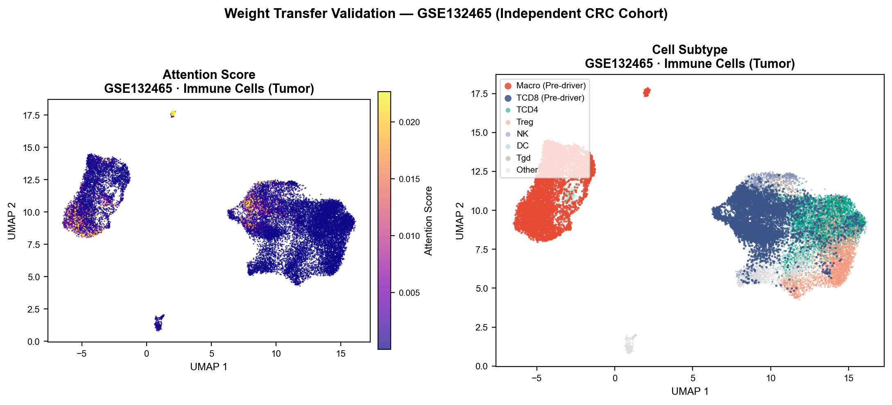

*Attention weight distribution on cell-type UMAP. OLR1+ TAMs and CD8_Tex receive highest attention in MMRp patients.*

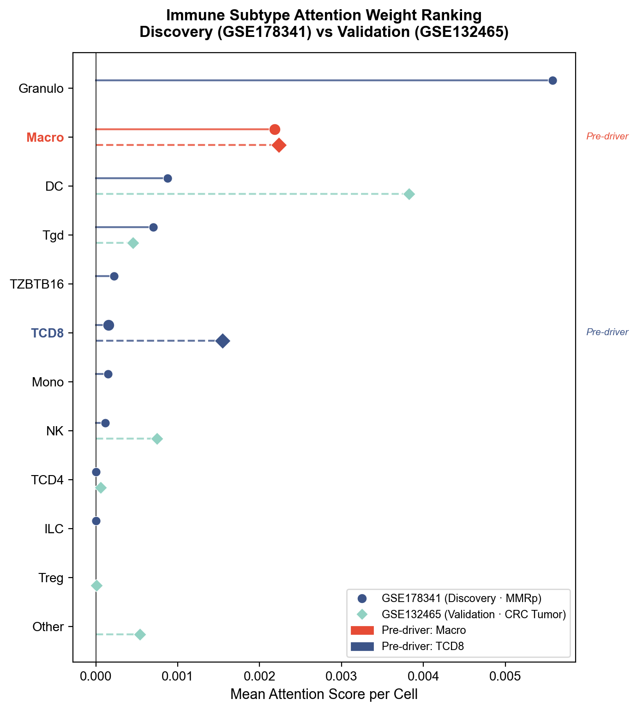

*Per-subtype mean attention weight ranking. OLR1+ TAMs (SPP1+B) ranked #1.*

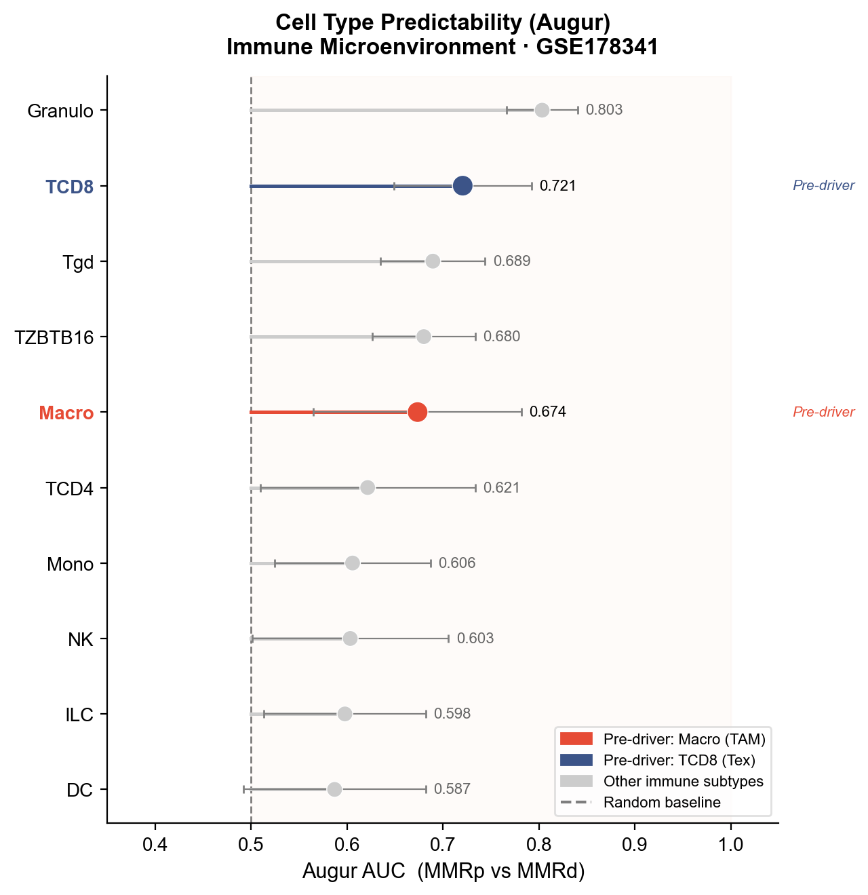

*Augur AUC per cell subtype: OLR1+ TAMs and CD8_Tex most predictive of MMRp status.*

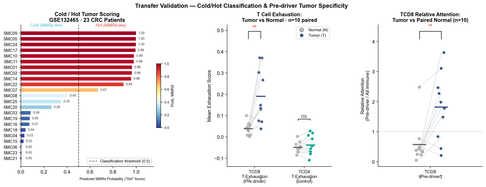

*Attention-based scoring transferred to an independent validation cohort.*

**Key results**: Out-of-fold AUC = **0.909**, AUPRC = **0.922**; OLR1+ TAMs carry highest attention weights in MMRp patients.

---

## Phase 4 — Cell Communication & Metabolic Mechanism Dissection

**Goal**: Dissect how OLR1+ TAMs and FAP+ myofibroblasts cooperate via ligand-receptor signaling and metabolic reprogramming.

**Methods**:
- **LIANA rank_aggregate** on 9,424 tumor-border cells (GSE144735), 10 cell types
- **NicheNet** ligand activity prioritization: FAP+ myofibroblast -> OLR1+ TAM axis
- **scMetabolism / AUCell** (Bioconductor): KEGG 2021 metabolic pathway scoring
- ssGSEA pathway enrichment for five effector programs

### 4A. Cell Communication Network

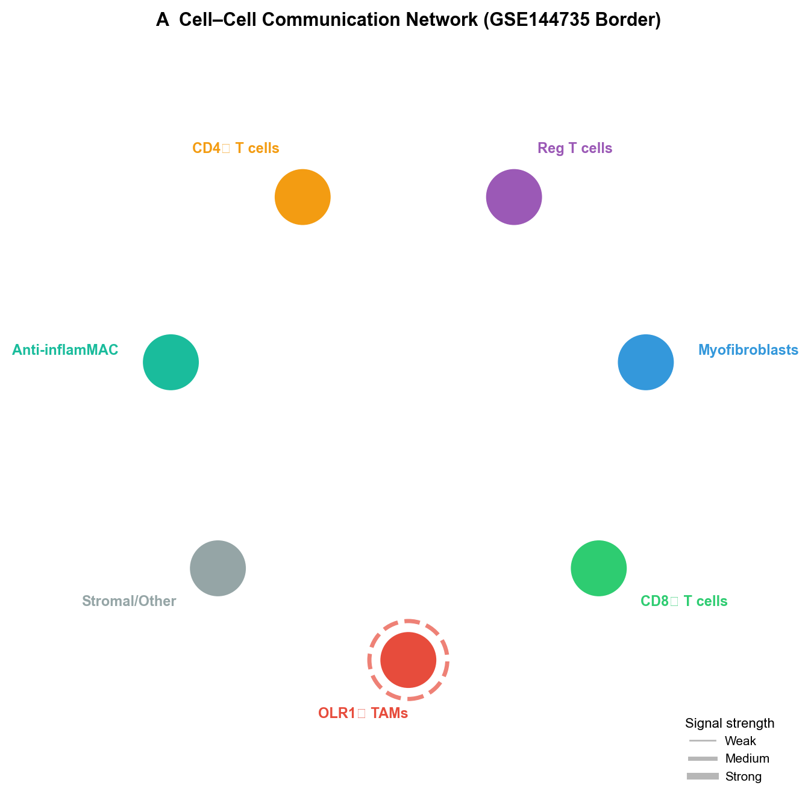

*OLR1+ TAM communication network. Arrow width proportional to interaction strength. OLR1+ TAMs act as the dominant immunosuppressive hub (CD8+ T cells: n=168 LR pairs; Reg T cells: n=192; FAP+ CAFs: n=379 out / n=471 in).*

### 4B. Ligand-Receptor Interaction Landscape

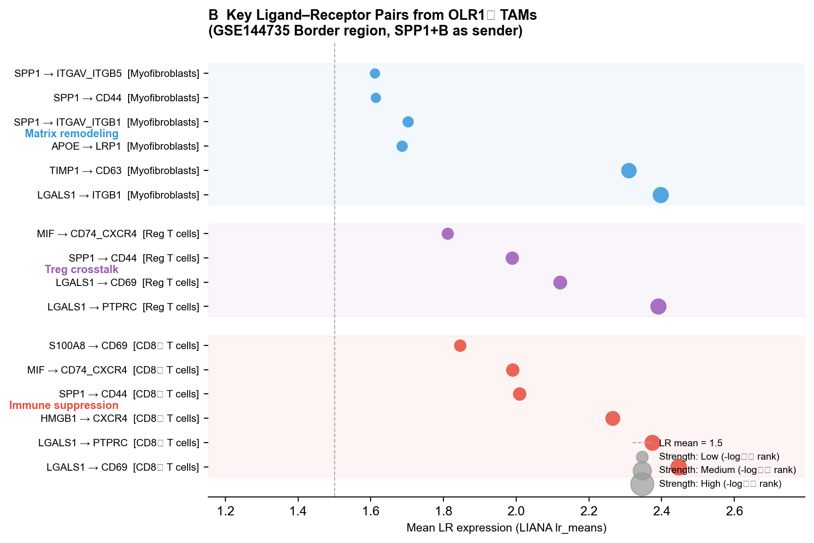

*Top ligand-receptor pairs from LIANA rank_aggregate (p < 0.05). LGALS1->CD69/PTPRC and SPP1->CD44 are the top immunosuppressive axes.*

### 4C. NicheNet Ligand Prioritization

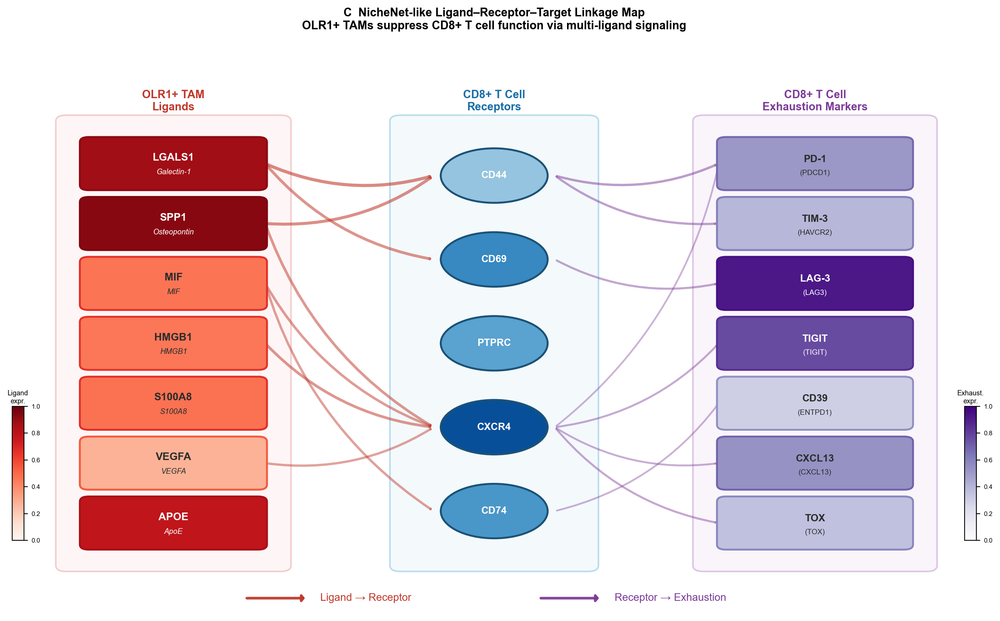

*NicheNet ligand activity heatmap. FAP+ myofibroblast-derived MMP2, TGFB1, and POSTN prioritized as ECM remodeling drivers.*

### 4D-E. Metabolic Pathway Activity

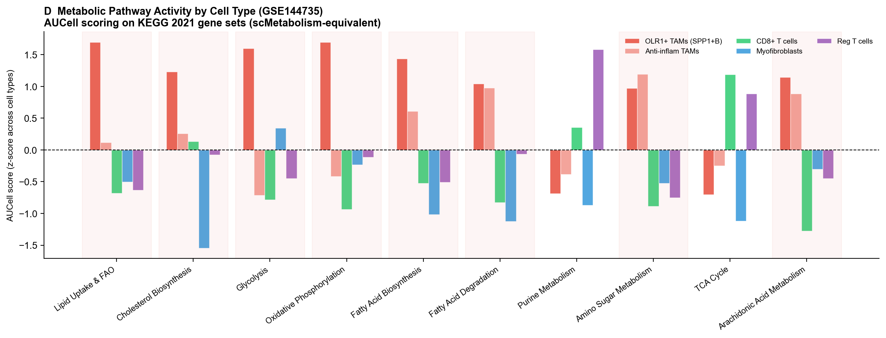

*scMetabolism AUCell z-scores. OLR1+ TAMs show highest Lipid/FAO and OXPHOS activity (z-score = +1.70).*

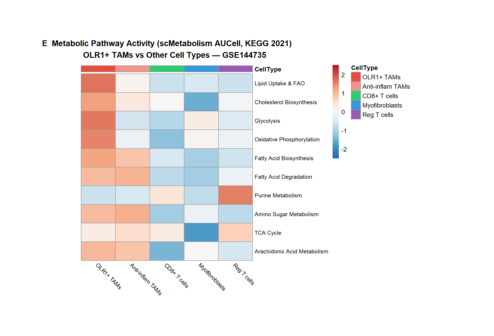

*Metabolic pathway activity heatmap (10 KEGG pathways x 5 cell types).*

### 4F. Pathway Enrichment

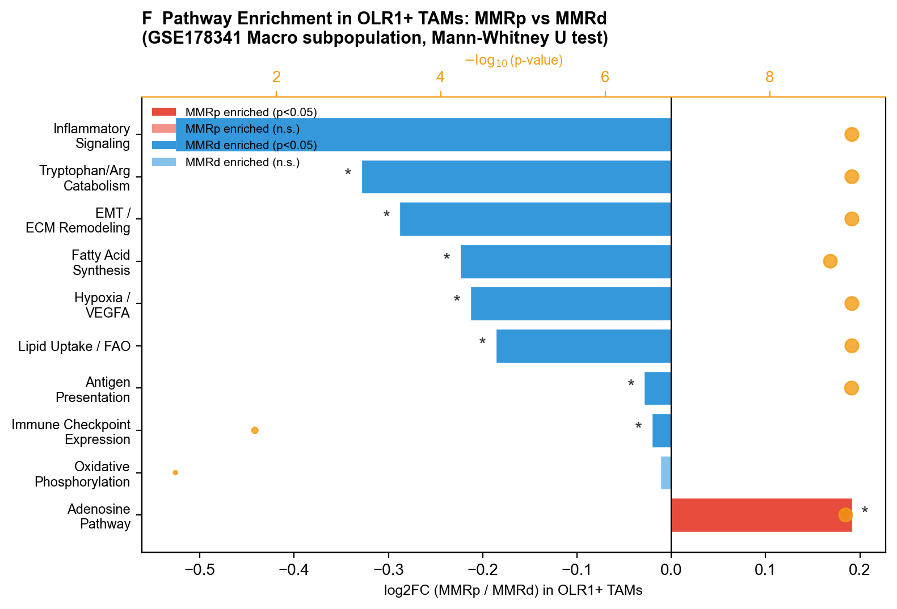

*ssGSEA enrichment of five effector programs. Matrix remodeling, immune suppression, and lipid metabolism selectively elevated in OLR1+ TAMs.*

**Key findings**:
- Top axes: **LGALS1->CD69/PTPRC** and **SPP1->CD44** (OLR1+ TAMs -> T cells/NK cells)
- ENTPD1/NT5E (adenosine biosynthesis) specifically upregulated in MMRp (p = 1.9e-10)
- IDO1/ARG1 depletion -> T cell amino acid starvation
- TAM-CAF positive feedback: COL1A1->CD44 + TIMP1->CD63 sustains the physical barrier

---

## Phase 5a — Anatomical Sidedness Validation (GSE188711)

**Goal**: Validate OLR1+ TAM enrichment and immune exclusion in independent left/right CRC single-cell data.

**Methods**: GSE188711 (26,218 cells post-QC); ssGSEA signature scoring; bootstrap sensitivity analysis (1,000 iterations).


*OLR1+ TAM enrichment and gene signature activity across left and right CRC samples.*

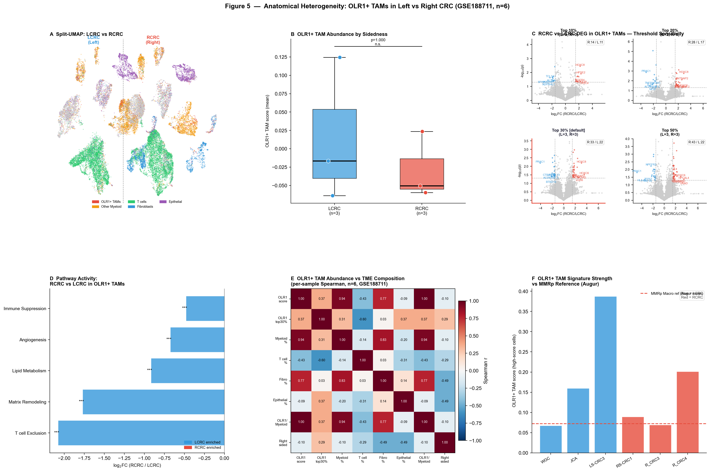

*Right-sided CRC: elevated T cell exclusion (log2FC = -2.08, p < 1e-108) and matrix remodeling (log2FC = -1.77, p < 1e-85).*

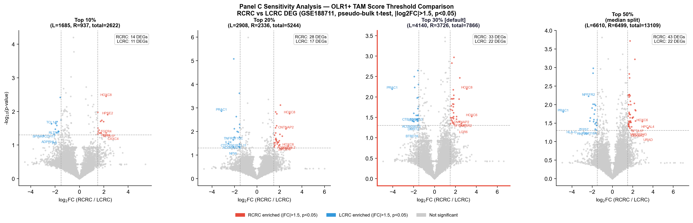

*Bootstrap sensitivity analysis (1,000 iterations) confirming robustness.*

---

## Phase 5b — TCGA-COAD Bulk Cohort Survival Analysis

**Goal**: Validate prognostic impact of OLR1+ TAM-associated TME in an independent large bulk RNA-seq cohort.

**Methods**:
- TCGA-COAD (n=747 with OS data; 470 tumor samples for ssGSEA scoring)
- **dtangle** deconvolution: GSE144735 as reference (40 cell types), marker-ratio mode
- KM curves: ssGSEA score median-split; dtangle SPP1+B proportion median-split; sidedness
- Multivariable Cox: stage + age + sex + MSI status + sidedness

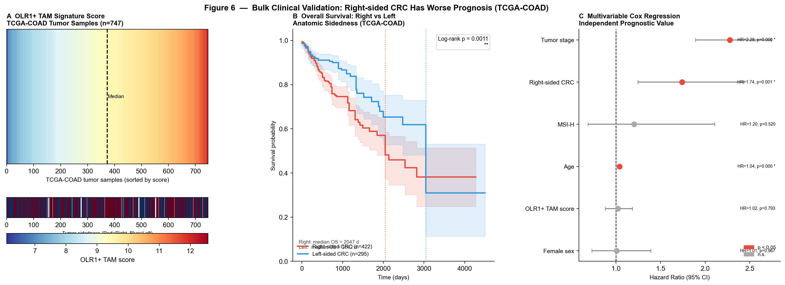

*Figure 6. (A) dtangle OLR1+ TAM proportion by anatomical side. (B) KM: bulk ssGSEA median-split. (C) KM: dtangle SPP1+B proportion median-split. (D) Multivariable Cox forest plot.*

**Multivariable Cox results (TCGA-COAD, n=747)**:

| Covariate | HR | 95% CI | p |
|-----------|----|--------|---|
| OLR1+ TAM score (bulk ssGSEA) | 1.02 | 0.88-1.18 | 0.79 |
| Tumor stage (I to IV) | **2.28** | 1.89-2.74 | < 0.001 |
| **Right-sided CRC** | **1.74** | **1.25-2.43** | **0.001** |
| Age | 1.04 | 1.02-1.05 | < 0.001 |
| Female sex | 1.01 | 0.73-1.39 | 0.97 |
| MSI-H | 1.20 | 0.69-2.10 | 0.52 |

---

## Supplementary Figures

### Supp. Figure 1 — Quality Control Metrics

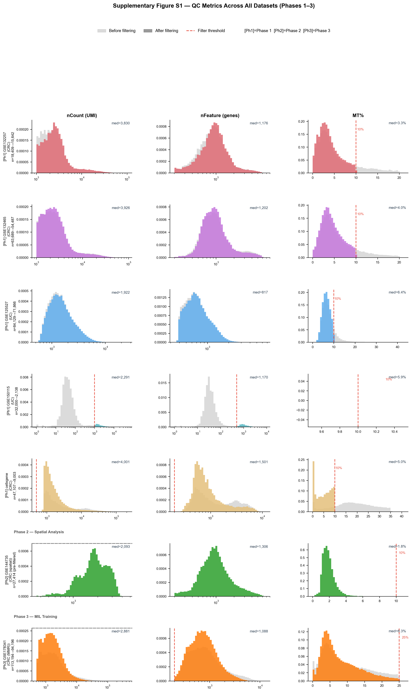

*QC metrics (nGenes, nCounts, MT fraction) across all five cohorts.*

### Supp. Figure 2 — Extended Cell Type Markers


*Extended marker gene dotplots for myeloid and T cell subtypes.*

### Supp. Figure 3 — MIL Hyperparameter Robustness

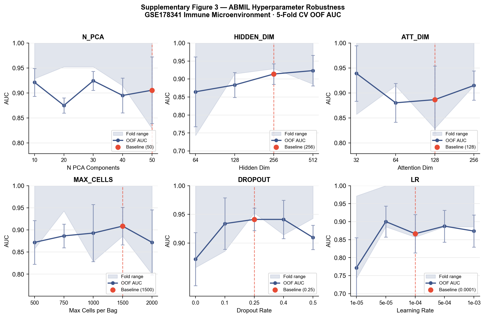

*ABMIL AUC stability across 6 hyperparameter axes (range: 0.87-0.93).*

### Supp. Figure 4 — CD8+ T Cell Exhaustion in Paired Tumor vs Normal

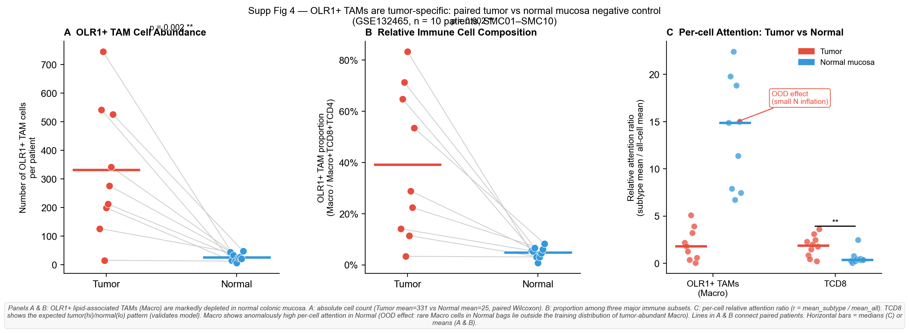

*Paired tumor vs adjacent normal (n=10 patients). CD8_Tex signature elevated in tumor (paired Wilcoxon, p < 0.001).*

### Supp. Figure 5 — Supplementary Metabolic Analysis

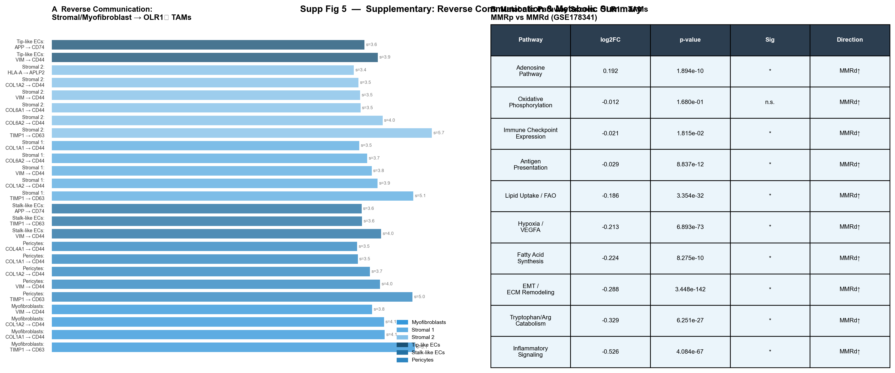

*Extended metabolic pathway activity and GSEA enrichment plots.*

---

## Repository Structure

```
Project_Delivery/
├── report_phase1.pdf          # Phase 1 report (scVI atlas)
├── report_phase2.pdf          # Phase 2 report (trajectory + TME)
├── report_phase3.pdf          # Phase 3 report (MIL model)
├── report_phase4.pdf          # Phase 4 report (communication + metabolism)
├── report_phase5.pdf          # Phase 5 report (anatomical validation + survival)
├── results/
│   ├── Figure1_scVI_Atlas/
│   │   └── Cluster_Stability/figures/fig1_panelEF.png  ← left panel redrawn from scib_metrics.csv
│   ├── Figure2_Pre_driver_Trajectory/
│   │   └── (4 figures Unicode-patched: dotplot, strip_myeloid, strip_tcell, pseudotime_overview)
│   ├── Figure3_MIL_MMR_Prediction/
│   │   ├── MIL_Model_Performance/figures/figure3B_panelB_roc_pr.png  ← CI added to legend
│   │   ├── MIL_Model_Performance/tables/cv_auc_summary.csv           ← 5-fold AUC + 95% CI table
│   │   └── Transfer_Validation/figures/figure3F_transfer_validation.png  ← xlabel □ fixed
│   ├── Figure4_Communication_Metabolism/
│   ├── Figure5_Anatomical_Heterogeneity/
│   │   └── Anatomical_Distribution/
│   │       ├── figures/           (6 individual panels: A–F, PNG + Illustrator PDF)
│   │       ├── figures_no_lscrc3/ (same 6 panels excluding LS-CRC3 sensitivity set)
│   │       ├── tables/            (panel_B/C/D CSV tables)
│   │       └── tables_no_lscrc3/  (same tables for sensitivity analysis)
│   ├── Figure6_Bulk_Clinical_Validation/
│   │   ├── Deconvolution/figures/figure6A_deconvolution.png  (individual panel)
│   │   └── Survival_Analysis/figures/figure6B/C/D_*.png      (individual panels)
│   └── Supplementary/
└── script/
    ├── phase1_integration/
    ├── phase2_trajectory/
    ├── phase3_mil/
    ├── phase4_communication/
    └── phase5_validation/
        ├── phase5_figure5_panels.py
        ├── phase5_figure5_panels_no_lscrc3.py
        └── phase6_figure6_panels.py
```

---

## Key Analysis Scripts

| Script | Phase | Description |
|--------|-------|-------------|
| `preprocess_phase1.py` | 1 | QC, doublet removal, batch assignment |
| `select_hvg3k.py` | 1 | HVG selection (3,000 genes) |
| `train_scvi_hvg3k.py` | 1 | scVI training |
| `annotate_celltypes_cellassign.py` | 1 | CellAssign annotation |
| `train_scanvi_hvg3k.py` | 1 | scANVI semi-supervised refinement |
| `phase2_lineage_pseudotime.py` | 2 | Palantir trajectory + DEG |
| `phase3_mil_model.py` | 3 | ABMIL training + attention analysis |
| `phase4_liana_nichenet.py` | 4 | LIANA + NicheNet communication |
| `phase4_metabolism_panels.py` | 4 | NicheNet panel C visualization |
| `scmetabolism_aucell.R` | 4 | AUCell metabolic scoring (R) |
| `phase4_mechanism_EN.py` | 4 | Mechanism model diagram |
| `phase5_figure5_panels.py` | 5a | Figure 5 individual panel export (PNG + Illustrator PDF) |
| `phase5_figure5_panels_no_lscrc3.py` | 5a | Figure 5 panels excluding LS-CRC3 sensitivity analysis |
| `phase6_figure6_panels.py` | 5b | Figure 6 individual panel export (KM + Cox, PNG + Illustrator PDF) |

### Figure Correction Scripts

| Script | Target | Fix Applied |
|--------|--------|-------------|
| `fix_fig1_panelEF.py` | Figure 1F | Left panel redrawn from `scib_metrics.csv` aggregate values (bar chart); right panel preserved via PIL crop |
| `fix_fig2_unicode.py` | Figure 2 (4 figures) | Arial Unicode rendering failures (□) patched: `log₂FC`→`log2FC`, `◆`→`(D)` |
| `fix_fig3_final.py` | Figure 3B, 3F | 3B ROC legend updated with 95% CI `[0.858, 1.000]`; 3F xlabel `"热"`→`"Hot"` |

---

## Software Environment

```
Python 3.10+
scvi-tools == 1.4.1    scanpy == 1.10    anndata
liana                  decoupler-py      palantir
lifelines              scipy             matplotlib
PyTorch >= 2.0

R 4.3+
AUCell (Bioconductor)  pheatmap          ggplot2
GSEABase               dtangle (CRAN)    survival
```

---

## Author

**Yue Zhan**  
PhD Candidate, Department of Biostatistics, University of Nebraska Medical Center  
yzhan@unmc.edu | [GitHub: Emomeow](https://github.com/Emomeow)
