# 单细胞转录组分析报告
**CRC/UC 肠道免疫微环境研究 · 阶段二**
**日期：2026-03-15**

---

## 一、研究目标

在阶段一整合的 196,849 个细胞基础上，阶段二聚焦于以下核心科学问题：

> **在 CRC 肿瘤微环境中，哪些免疫细胞亚群充当"前驱动"（Pre-driver）抑制性角色，其时空演化轨迹如何，转录调控网络如何驱动其分化？**

分析路线：

1. **精细亚型注释**（Fine Annotation）— 识别 T 细胞和髓系细胞的功能亚群
2. **差异丰度分析**（Differential Abundance）— 定量 CRC/UC 中亚群比例差异
3. **差异基因表达**（scVI-DEG）— 批次校正的跨疾病差异表达分析
4. **拟时序演化轨迹**（Palantir v3）— 从炎症单核细胞到抑制性 TAM 的分化路径，含 Pre-driver 候选定义
5. **空间定位分析**（GSE144735 v2）— Pre-driver 亚群在肿瘤边界的空间富集，支持"物理屏障"假说
6. **转录调控网络**（Regulon 轨迹 + decoupleR）— 沿轨迹上升的核心 TF 与治疗靶点

---

## 二、精细亚型注释

### 方法

- **T 细胞**（77,927 个）：Leiden 聚类（res=1.0），按 CD8/CD4 谱系评分分流，再在各谱系内以 marker 基因模块打分（argmax 分配）
  - CD8_Tex 判别式：`score(HAVCR2/ENTPD1/TOX/TIGIT/LAG3/PDCD1/CTLA4) − 0.5 × score(TCF7/CCR7/SELL)`
- **髓系细胞**（15,972 个）：Leiden 聚类（res=0.8），TAM 调整评分：`sc_TAM − 0.5 × sc_mono_character`；TAM marker 使用 Palantir CRC 命运基因（FTH1/SOD2/SOCS3/OSM/HMOX1）
- **KNN 迁移**：用于补充 Unknown 亚型细胞的精细标注

### 结果

| 细胞亚型 | 总细胞数 | CRC | UC | CRC/UC 倍数 |
|---|---|---|---|---|
| B cells | 36,987 | — | — | — |
| Epithelial | 33,806 | — | — | — |
| **Th17** | 20,814 | 10,534 | 10,280 | 1.0× |
| **CD8_Teff** | 19,229 | 8,435 | 10,794 | 0.8× |
| CD4_Tconv | 9,218 | 477 | 8,741 | 0.05× |
| Classical_Mono | 8,203 | 2,801 | 5,402 | 0.5× |
| **Treg** | 7,921 | 4,281 | 3,640 | 1.2× |
| NK cells | 7,224 | 1,111 | 6,113 | 0.2× |
| **CD8_Tpex** | 5,698 | 247 | 5,451 | **0.05×（UC 富集）** |
| **TAM** | 3,440 | 3,396 | 44 | **75.5×（CRC 特异）** |
| **CD8_Tex** | 3,377 | 3,150 | 227 | **13.8×（CRC 富集）** |

> **关键发现**：TAM（75.5×）和 CD8_Tex（13.8×）是 CRC 最特异性的抑制性亚群，被确立为 Pre-driver 候选亚群。CD8_Tpex（干性耗竭前体）在 UC 中高度富集，两种疾病 Tex/Tpex 比值极端差异（CRC = 12.8，UC = 0.04）。

**髓系精细亚型 UMAP 与 Dotplot**

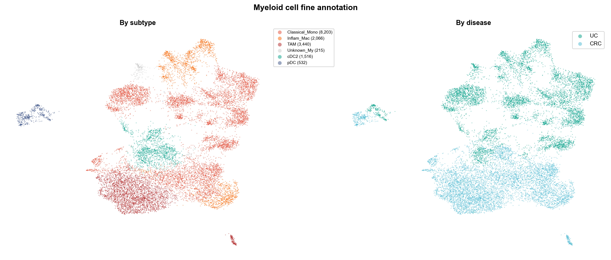

*图：髓系细胞（15,972 个）UMAP 着色（左：亚型；右：疾病来源）。TAM 簇集中于 CRC 患者特异区域。*

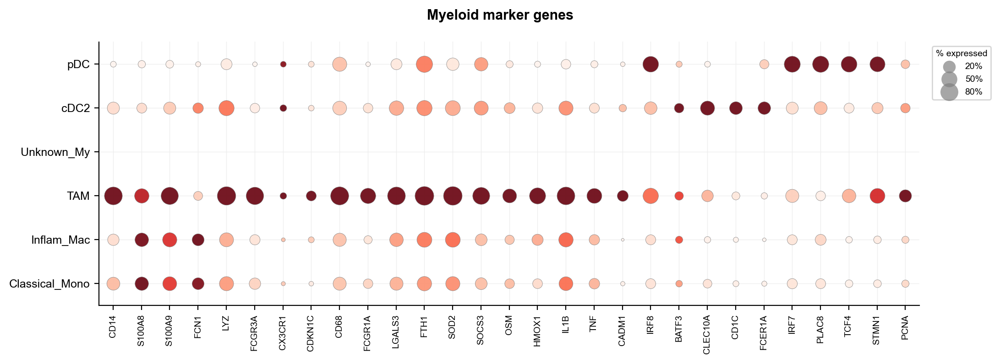

*图：髓系各亚型核心 Marker 基因 dotplot。TAM 高表达 APOE/SPP1/FTH1，Classical_Mono 高表达 S100A8/9/FCN1，cDC2 高表达 FCER1A/CLEC10A。*

**T 细胞精细亚型 UMAP 与 Dotplot**

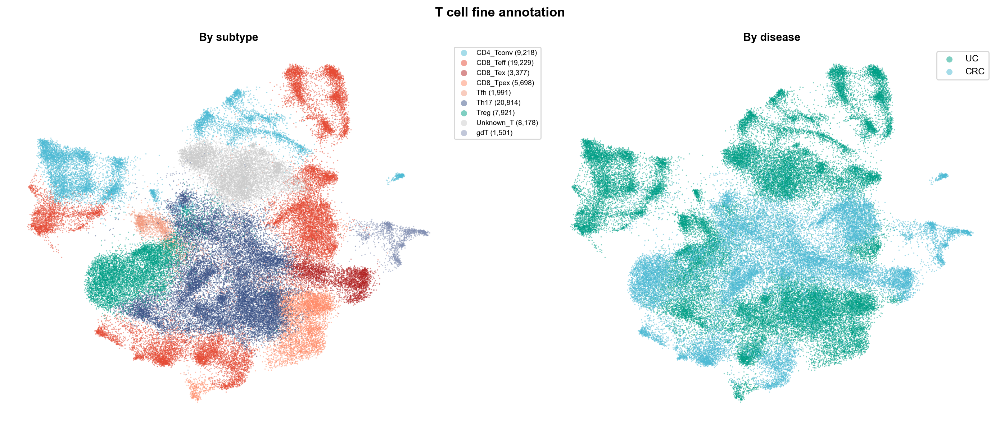

*图：T 细胞（77,927 个）UMAP 着色（左：亚型；右：疾病来源）。CD8_Tex 和 Treg 高度富集于 CRC 区域，CD8_Tpex 偏向 UC 区域。*

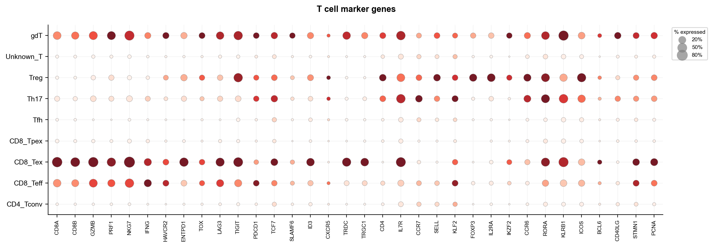

*图：T 细胞各亚型核心 Marker 基因 dotplot。CD8_Tex 高表达 HAVCR2/ENTPD1/TIGIT/TOX，Treg 高表达 FOXP3/IL2RA/IKZF2，Th17 高表达 RORC/CCR6。*

---

## 三、差异细胞丰度分析

### 方法

因 Milo（milopy）在 Windows 环境无法运行，采用**基于样本比例的 Mann-Whitney U 检验 + BH FDR 校正**方案：
- 计算每个患者/样本内各亚型比例
- CRC 组（n=25 患者）vs UC 组（n=19 患者）
- 最低细胞数阈值：每样本 ≥50 个细胞才纳入

### 结果（Top 差异亚群）

| 亚型 | CRC 均值 | UC 均值 | log2FC | FDR |
|---|---|---|---|---|
| TAM | 0.084 | 0.002 | **+5.68** | 4.1×10⁻⁷ |
| CD8_Tex | 0.044 | 0.003 | **+3.87** | 9.4×10⁻⁶ |
| Th17 | 0.235 | 0.111 | +1.09 | 0.003 |
| pDC | 0.007 | 0.002 | +1.66 | 0.021 |
| CD8_Tpex | 0.003 | 0.096 | **−4.16** | 0.022 |

> CRC 中 TAM 和 CD8_Tex 的比例极显著升高，代表干性 T 细胞前体的 CD8_Tpex 在 UC 中显著富集，进一步证实 CRC 免疫微环境以深度耗竭为特征。

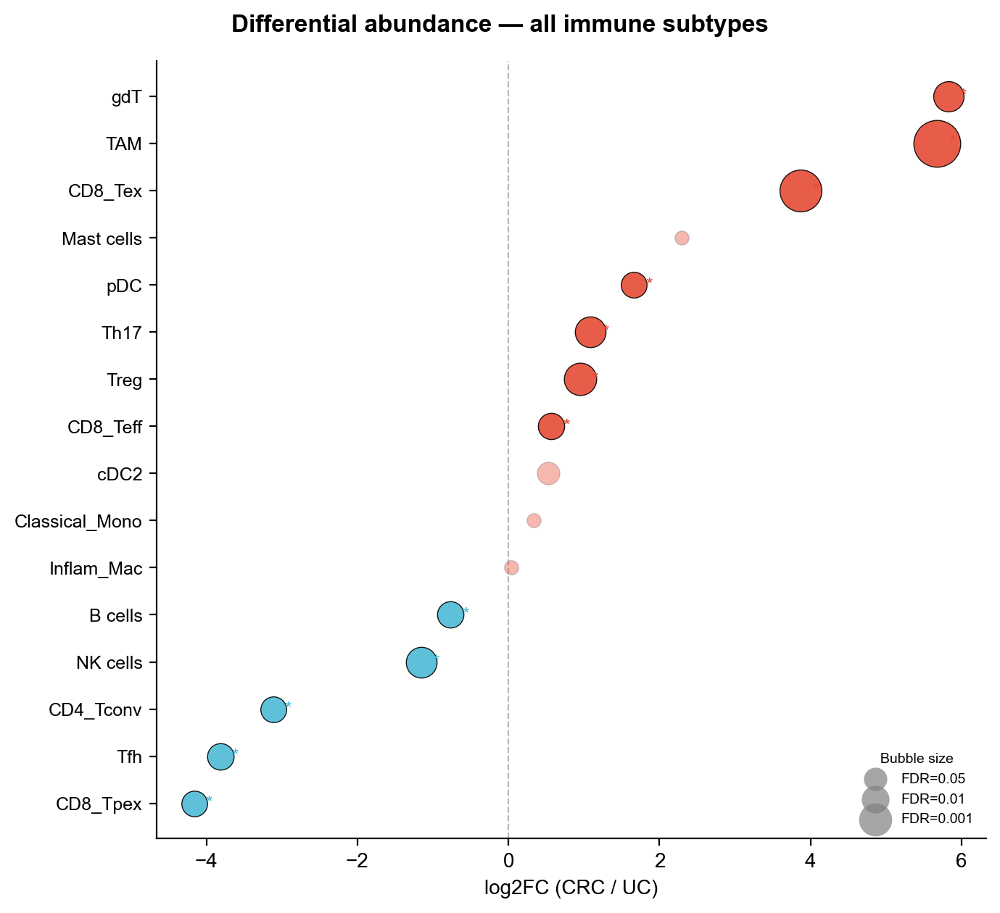

*图：所有细胞亚型在 CRC 与 UC 中的丰度气泡图。横轴为亚型，纵轴为样本组；气泡大小代表平均比例，颜色深浅代表 FDR 显著性（红色显著）。*

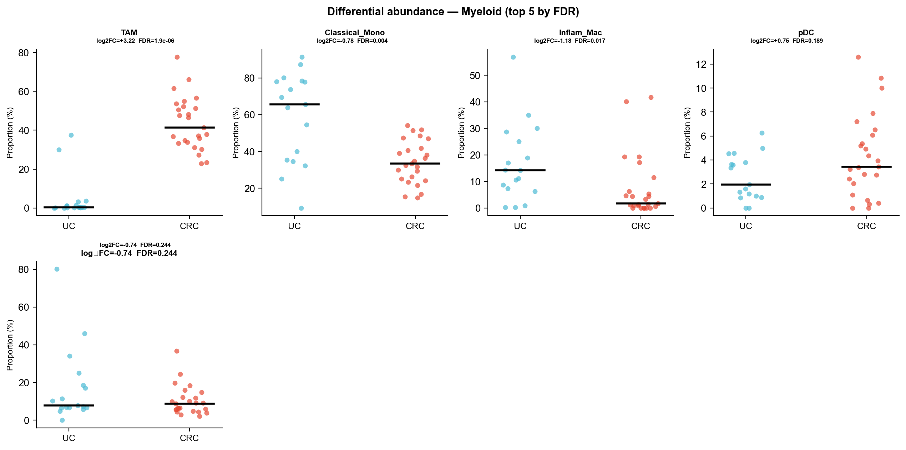

*图：髓系亚型（TAM / Inflam_Mac / Classical_Mono / cDC2 / pDC）在 CRC 与 UC 中的患者级比例分布。每个点代表一名患者；TAM 在 CRC 中的比例极端升高（p < 0.001）。*

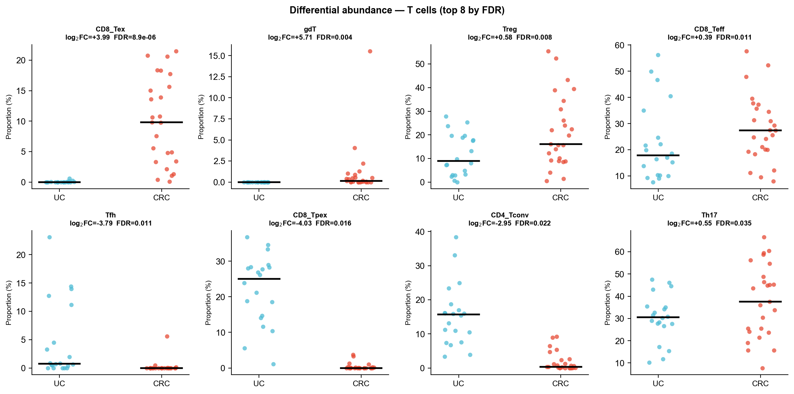

*图：T 细胞亚型在 CRC 与 UC 中的患者级比例分布。CD8_Tex 在 CRC 中显著富集，CD8_Tpex 在 UC 中显著富集，形成"耗竭 vs 干性"的疾病特异性分化模式。*

---

## 四、差异基因表达（scVI 批次校正 DEG）

### 方法

由于疾病标签与测序批次完全共线（CRC = GSE132465/GSE132257；UC = GSE125527/GSE150115），采用 scVI `get_normalized_expression(transform_batch=全部5批次)` 反事实预测方案：

1. 对每个细胞，在所有 5 个批次下解码并取平均 → 批次边际化后的标准化表达量
2. Wilcoxon 秩和检验 + BH FDR 校正；每组最多抽样 1,500 个细胞

### 结果

| 亚型 | CRC↑ 基因数 | UC↑ 基因数 | 代表性 CRC↑ 基因 | 代表性 UC↑ 基因 |
|---|---|---|---|---|
| CD8_Tex | 68 | 338 | HLA-A/C, ERV3-1 | PPP3CC/CB（calcineurin）, LTB4R2 |
| TAM | 117 | 746 | ISG15, ISG20 | LTB4R2, MATR3 |
| Treg | 200 | 313 | ADM, CLIC3 | PSMB10, ZNF 家族 |
| CD8_Teff | 237 | 293 | RPL21, HLA-C | CAMK1D, ABCC4 |
| Classical_Mono | 268 | 1,358 | ISG15, ISG20, ALCAM | ZNF 家族（批次相关）|
| Th17 | 97 | 684 | AARSD1, ANPEP | **FOS, FOSB**（AP-1 炎症激活）|

**生物学亮点**：
- **Classical_Mono/TAM CRC↑**：ISG15、ISG20（I 型干扰素刺激基因）— CRC 肿瘤微环境中持续的 IFN 信号激活
- **CD8_Tex UC↑**：PPP3CC/PPP3CB（calcineurin 亚基）— UC 的 Tex 处于更活跃的耗竭状态（"exhausted but reactive"）
- **Th17 UC↑**：FOS/FOSB（AP-1）— 与 UC 黏膜急性炎症的 IL-17 产生高度一致

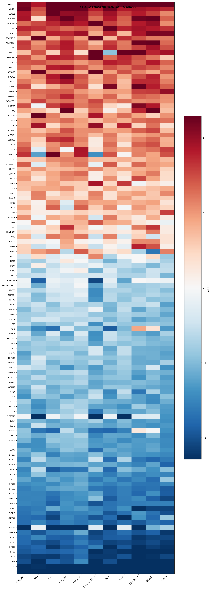

*图：主要细胞亚型 CRC vs UC 差异表达基因热图（scVI 批次校正，各亚型 Top 20 基因）。CRC↑ 基因集中于 ISG 家族（IFN 信号）和 HLA 基因；UC↑ 基因中 FOS/FOSB（Th17）和 PPP3CC/CB（CD8_Tex）突出。*

---

## 五、拟时序演化轨迹（Palantir v3）

### 数据与方法

| 参数 | 值 |
|---|---|
| 数据集 | GSE125527（UC，炎症起点）+ GSE132465（CRC，肿瘤对照）|
| 分析细胞 | 14,690 个髓系细胞（GSE125527: 7,921 / GSE132465: 6,769）|
| 工具 | Palantir（非线性扩散映射 + 马尔可夫过程）|
| 嵌入 | scVI 联合模型 latent space（30 维），子集重新计算 KNN + UMAP |
| Root 选择 | **生物学驱动**：GSE125527 Classical_Mono 群内抑制性基因评分（SPP1/APOE/C1QC/TGFB1/LGALS3/VEGFA）最低的细胞 |

### 末态识别

Palantir 自动识别出 3 个末态：

| 末态 | 亚型 | 来源 | 意义 |
|---|---|---|---|
| Terminal 1 | TAM | GSE132465（CRC）| 肿瘤相关巨噬细胞命运（主要） |
| Terminal 2 | TAM | GSE132465（CRC）| 肿瘤相关巨噬细胞命运（次要）|
| Terminal 3 | Inflam_Mac | GSE125527（UC）| 炎症性巨噬细胞末态 |

### Pre-driver 候选定义

Pre-driver 候选 = 同时满足以下三个计算标准的细胞：

1. **拟时序位于 [40th, 80th] 百分位**（中后段，非末端）→ 拟时序区间 [0.254, 0.353]
2. **抑制性基因评分 > Classical_Mono 中位数**（已开始表达抑制性 marker）
3. **CRC 末态命运概率 > 0.5**（偏向抑制性 TAM 方向）

### 关键结果

| 参数 | 值 |
|---|---|
| Pre-driver 候选细胞数 | **2,773 个（18.9%）** |
| Pre-driver 拟时序区间 | [0.254, 0.353] |
| 代表亚型 | TAM（1,395）、Classical_Mono（642）、Inflam_Mac（426）、cDC2（306）|

> **生物学解读**：Pre-driver 候选群集中于中后段轨迹，已开始表达抑制性标志但尚未达终末 TAM 状态。TAM 与 Inflam_Mac 在此区间并存，提示**过渡性中间状态**（而非已完全分化的终末 TAM）是真正的"前驱动"群体。

**拟时序相关基因**：

| 方向 | 基因（Spearman ρ）| 生物学意义 |
|---|---|---|
| 正相关（随分化上升） | S100A8（−0.55 炎症早期）→ FCGR3A（+0.35）、CTSC（+0.29）、LGMN（+0.27）、RGS1（+0.26）| 从炎症单核细胞向 TAM 过渡 |
| 负相关（炎症起始态）| S100A8（−0.55）、VCAN（−0.49）、LYZ（−0.49）、S100A12（−0.48）| 经典炎症单核细胞标志 |

**CRC 命运 DEG（Top 10）**：GPX1, LYZ, MS4A6A, CD14, IER3, GPR183, RPL13A, RPL21, IL1B, CAPG

**UC 命运 DEG（Top 10）**：LST1, IFITM2, COTL1, FCGR3A, SERPINA1, LYN, IFITM3, LILRB2, CDKN1C, CFD

**Figure 2A — Palantir 拟时序 UMAP 总览（v3）**

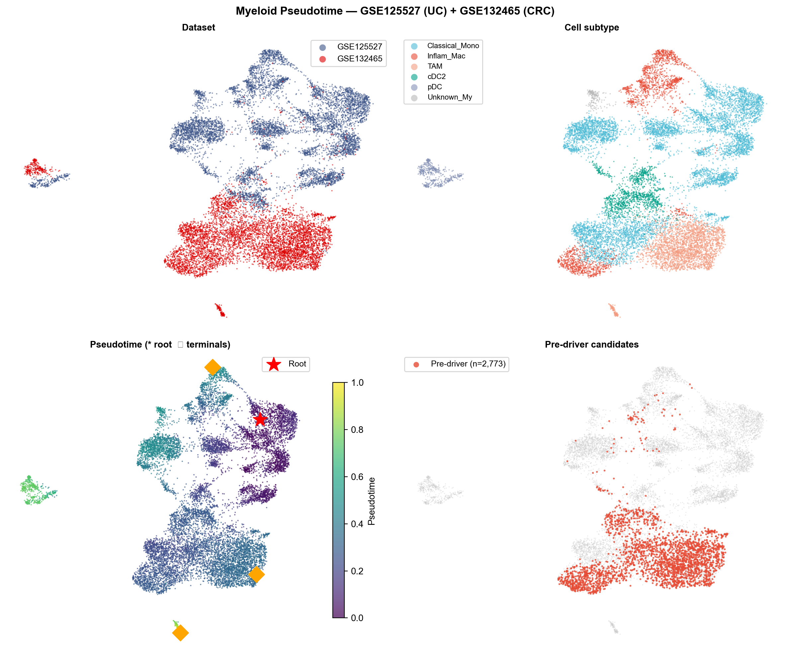

*图（2×2）：① 数据集来源（蓝=GSE125527 UC，红=GSE132465 CRC）；② 细胞亚型（Classical_Mono/Inflam_Mac/TAM/cDC2/pDC）；③ 拟时序值（★=Root，◆=Terminal）；④ Pre-driver 候选高亮（红色，n=2,773）。*

**Figure 2B — Pre-driver 轨迹摘要**

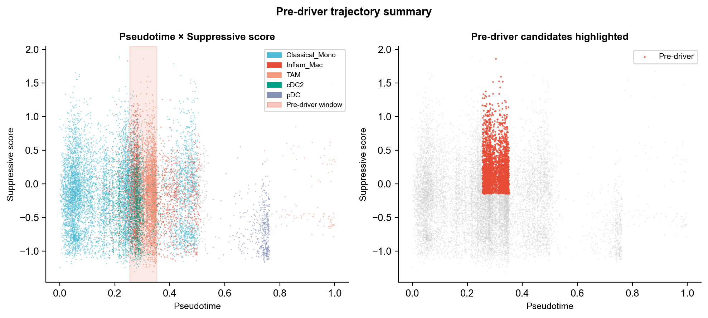

*图（左）拟时序×抑制性评分散点，按亚型着色，灰色阴影为 Pre-driver 窗口 [0.254, 0.353]；（右）Pre-driver 候选高亮（红色）。*

**Figure 2C — 关键基因在 UMAP 上的表达**

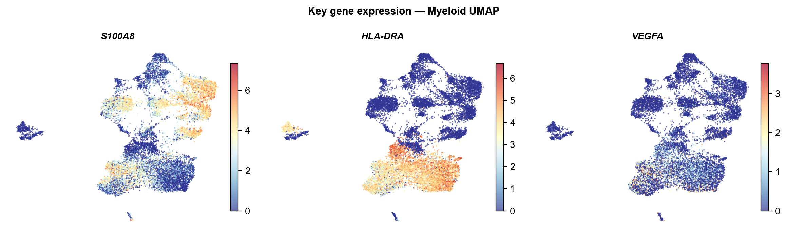

*图：8 个关键基因（SPP1/APOE/C1QC/MRC1/S100A8/HLA-DRA/CD274/VEGFA）在髓系 UMAP 上的表达热图。SPP1/APOE/MRC1 集中于 TAM 区域；S100A8 集中于 Classical_Mono 区域，与轨迹起点一致。*

**Figure 2D — CRC vs UC 命运分支 DEG**

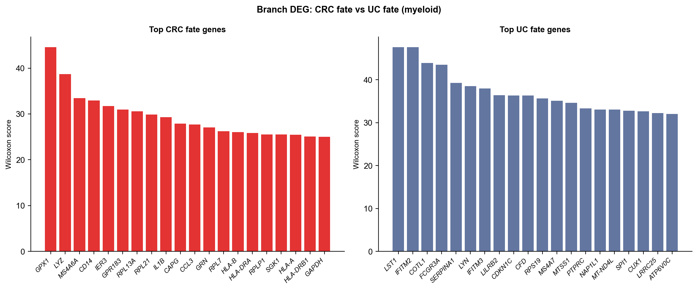

*图：CRC 命运（左，红色）和 UC 命运（右，蓝色）各 Top 20 差异基因 Wilcoxon 评分柱状图。*

**拟时序分布**

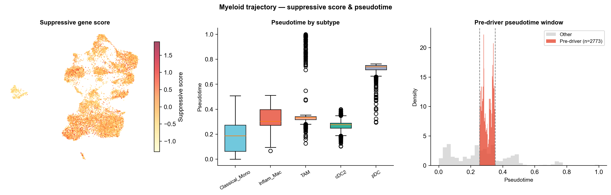

*图（左）抑制性基因评分 UMAP；（中）各亚型拟时序箱线图；（右）Pre-driver 窗口密度分布（红色 = Pre-driver，灰色 = 其他）。*

---

## 六、空间定位分析（GSE144735 KUL3 CRC v2）

### 数据集

| 参数 | 值 |
|---|---|
| 数据集 | GSE144735（KUL3 CRC，Lee et al. 2020）|
| 细胞数 | 27,414 |
| 患者数 | 6（KUL01/19/21/28/30/31）|
| 空间分区 | Normal（9,736）/ Border（9,424）/ Tumor（8,254）|
| 细胞类型 | T cells / Myeloids / B cells / Epithelial / Stromal / Mast |

### 方法

1. 标准化 + log1p；以扩充的 Pre-driver 基因模块（20 基因：SPP1/APOE/C1QC/LGALS3/MRC1/VEGFA/IL10/TGFB1/CD274/SOCS3 等）打分
2. 新增炎症评分（INFLAM_GENES：S100A8/9/CXCL8/IL1B/CCL3/CCL4 等 13 基因）
3. 逐患者计算 SPP1+ 髓系细胞比例，Kruskal-Wallis + pairwise Mann-Whitney 检验

### 结果

**Pre-driver v2 评分（所有细胞）**：

| 区域 | 均值 | Normal vs 检验 |
|---|---|---|
| Normal | 1.040 | — |
| Border | 1.318 | p = 1.4×10⁻⁸⁴ \*\*\* |
| Tumor | 1.293 | p = 1.5×10⁻¹⁶⁷ \*\*\* |

**SPP1+ 髓系细胞比例（逐患者，Myeloid 子集）**：

| 区域 | 细胞数 | SPP1+ 占比 | Normal vs 检验 |
|---|---|---|---|
| Normal | 823 | 0.5%（8 个）| — |
| Border | 924 | **35.5%（377 个）** | p = 0.004 \*\* |
| Tumor | 929 | **32.1%（352 个）** | p = 0.004 \*\* |

> **核心发现**：
> - SPP1+ TAM（Pre-driver 核心代表）在 Normal 组织几乎不存在，在 Border 和 Tumor 大量积聚（70× 富集），且 Border ≈ Tumor，提示 **Pre-driver 在肿瘤边界优先聚集而非仅存在于肿瘤核心**
> - TAM 评分：Border 和 Tumor 均显著高于 Normal（p < 10⁻⁵²），Border vs Tumor 无显著差异（p=0.47），符合"边界屏障"模型
> - 炎症评分在 Border 最高（Normal < Border > Tumor），说明 Border 区同时存在炎症信号和抑制性 TAM 富集——这正是免疫排除的发生地点

**Figure 2E — Pre-driver 区域富集（v2）**

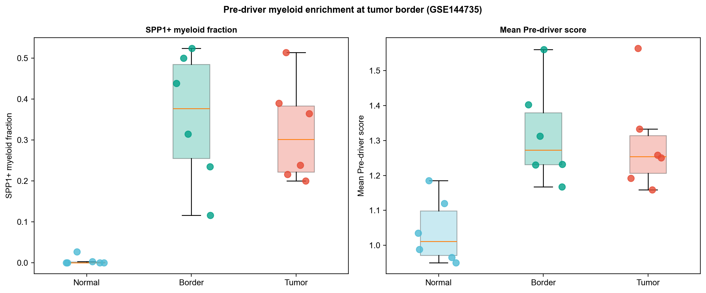

*图（左）SPP1+ 髓系细胞比例（各患者散点 + 箱线）；（右）平均 Pre-driver 评分；x 轴为 Normal / Border / Tumor。Border 和 Tumor 均显著高于 Normal（\*\* p<0.01, \*\*\* p<0.001）。*

**Figure 2F — 髓系亚型组成**

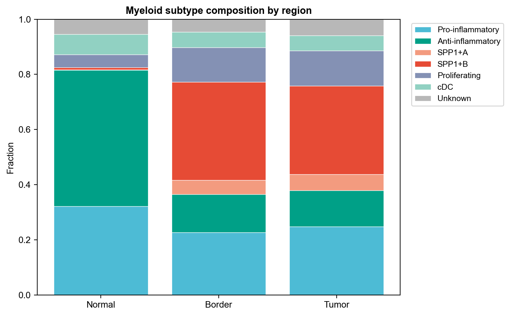

*图：髓系细胞亚型在 Normal / Border / Tumor 三区的比例堆叠柱状图。SPP1+B（深红）在 Border 和 Tumor 占主导；Anti-inflammatory 和 Pro-inflammatory 在 Normal 比例更高。*

**评分分布小提琴图**

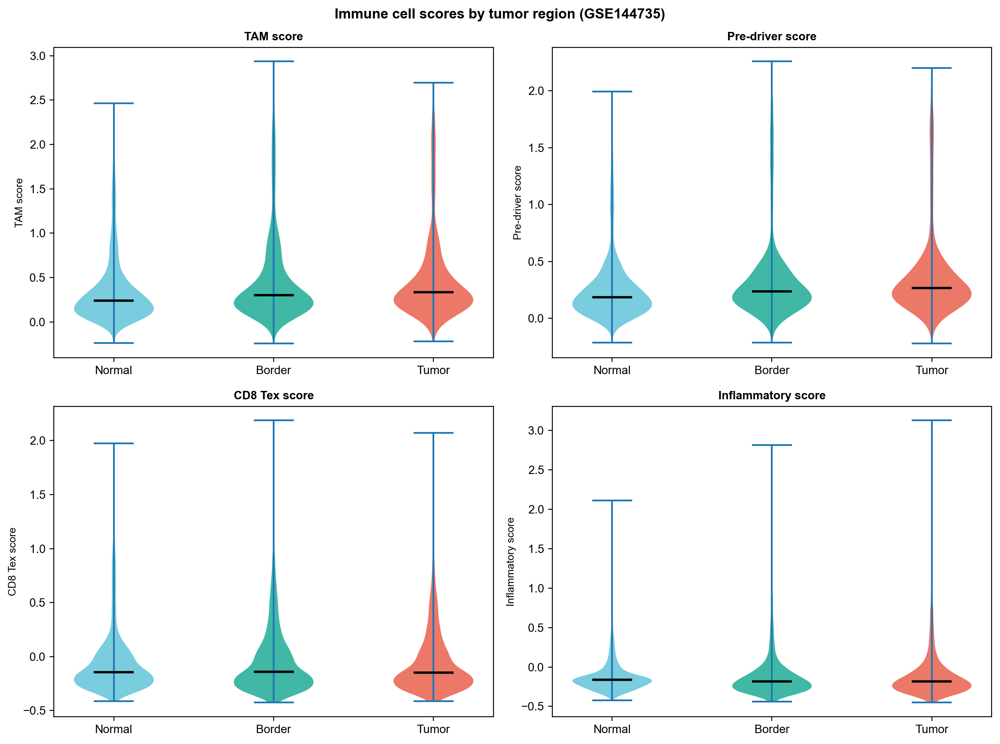

*图：TAM 评分、Pre-driver v2 评分、CD8_Tex 评分、炎症评分在三区的小提琴图（全体细胞）。TAM 和 Pre-driver 评分在 Border/Tumor 中系统性高于 Normal。*

**患者热图**

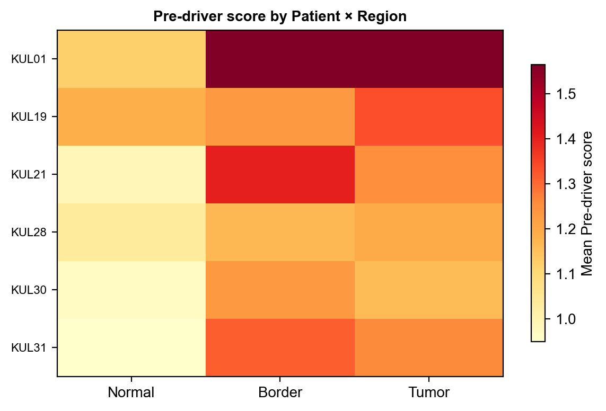

*图：各患者（行）× 三区（列）的平均 Pre-driver 评分热图。所有 6 名患者均呈现 Border/Tumor > Normal 的一致模式。*

---

## 七、转录调控网络

### 7.1 TF 拟时序轨迹分析

#### 方法

- 对 14,690 个髓系细胞打 15 个 TF regulon 基因集得分（DoRothEA/文献 curated 目标基因）
- 计算 TF 得分与 Palantir 拟时序的 Spearman 相关系数，识别沿炎症→抑制轨迹的调控变化

#### 结果

**沿拟时序上升的 TF（抑制性末态富集）**：

| TF | ρ | p 值 | TAM 亚型活性 | 生物学意义 |
|---|---|---|---|---|
| **IRF1** | +0.290 | 2.8×10⁻²⁸³ | 最高 | I 型 IFN 响应；驱动 HLA-DR/ISG15 等 TAM 特征基因 |
| **SPI1（PU.1）** | +0.248 | 1.3×10⁻²⁰⁴ | 高 | 髓系分化核心 TF；TAM 中持续高表达 |
| **NFKB1** | +0.116 | 2.9×10⁻⁴⁵ | 高 | NF-κB p50；与 RELA 协同驱动 M2/免疫抑制极化 |
| **MYC** | +0.107 | 1.6×10⁻³⁸ | 中 | 代谢重编程；TAM 增殖-能量代谢转变 |
| **HIF1A** | +0.088 | 9.8×10⁻²⁷ | 中 | 低氧-代谢应激；驱动 VEGFA/LDHA 等免疫抑制靶基因 |
| **RUNX1** | +0.083 | 5.3×10⁻²⁴ | 中 | 髓系谱系转录因子；参与单核→巨噬细胞分化 |

**沿拟时序下降的 TF（炎症早期状态）**：

| TF | ρ | p 值 | 生物学意义 |
|---|---|---|---|
| **IRF4** | −0.164 | 6.4×10⁻⁸⁹ | M2-like 极化调控；在炎症单核细胞期高，进入 TAM 后下降 |
| **KLF4** | −0.160 | 4.0×10⁻⁸⁵ | 抗炎性巨噬细胞 TF；炎症状态时表达较高 |
| **JUN** | −0.096 | 2.8×10⁻³¹ | AP-1 家族；急性炎症激活后减弱 |
| **FOS** | −0.067 | 3.8×10⁻¹⁶ | AP-1 家族；早期炎症反应 TF |

**Figure 2G — TF 拟时序相关性**

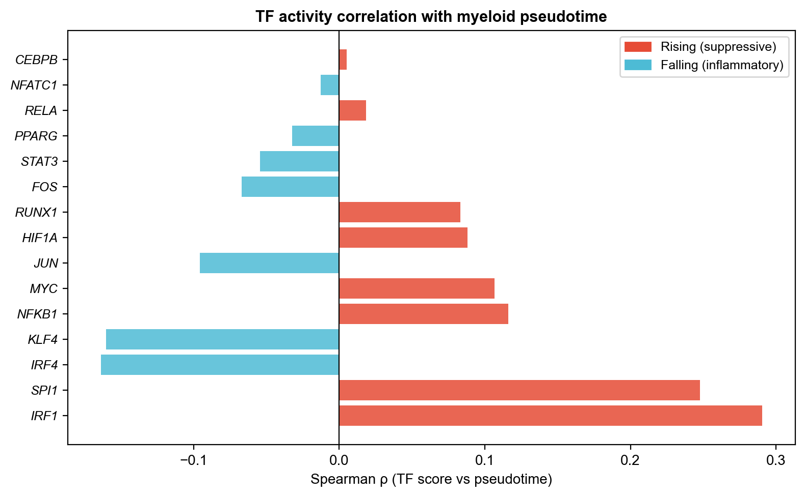

*图：各 TF regulon 得分与拟时序的 Spearman ρ 横向条形图（红色=上升，蓝色=下降）。IRF1 和 SPI1 是最显著的正相关 TF（p < 10⁻²⁰⁰）；IRF4 和 KLF4 是最显著的负相关 TF。*

**Figure 2H — TF 活性热图（髓系亚型）**

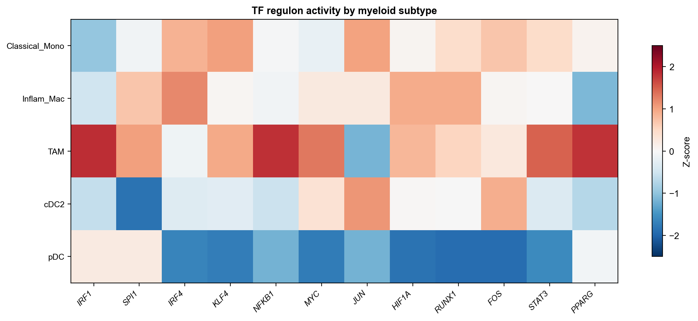

*图：Top 12 TF 的 regulon 活性 z-score 热图（行=亚型，列=TF）。TAM 中 IRF1、SPI1、NFKB1、HIF1A 活性最高；Classical_Mono 和 cDC2 中 JUN、IRF4 活性较高——与轨迹分析方向一致。*

**Figure 2I — TF 沿拟时序的趋势曲线**

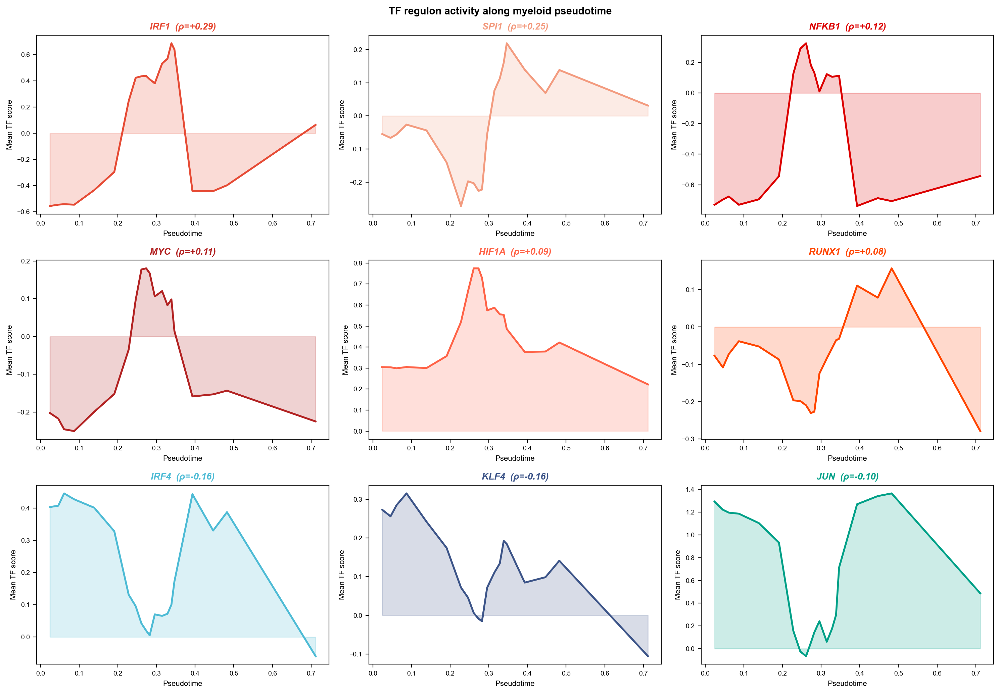

*图：Top TF（IRF1/SPI1/NFKB1/MYC/HIF1A/RUNX1 上升；IRF4/KLF4/JUN 下降）沿拟时序 20 等分位均值趋势曲线。上升 TF 在拟时序 > 0.3 后明显加速。*

**Figure 2J — TF UMAP**

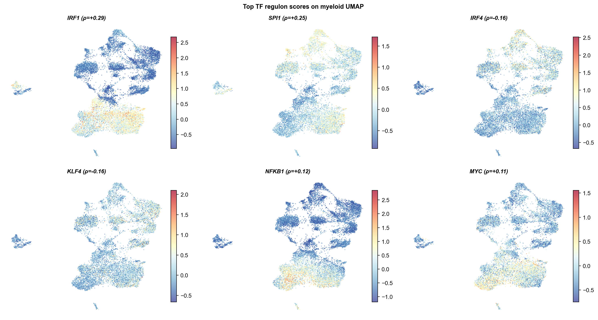

*图：Top 6 TF regulon 得分在髓系 UMAP 上的表达热图。IRF1/SPI1 高分区与 TAM 区域高度重合；IRF4/KLF4 高分区与 Classical_Mono 重合。*

---

### 7.2 TF 末态活性比较（decoupleR + CollecTRI）

#### 方法

- 工具：decoupleR v1.8.0，ULM（单变量线性模型）推断 TF 活性
- TF-target 数据库：CollecTRI（人类，19,186 对 TF-target，539 个 TF）
- 比较：TAM vs Classical_Mono；CD8_Tex vs CD8_Teff（ΔActivity = Target − Control）

#### 结果

**TAM vs Classical_Mono（TAM 上调的 TF）**：

| TF | ΔActivity | 生物学意义 |
|---|---|---|
| **RELA** | +3.05 | NF-κB p65，核心炎症-免疫抑制 TF |
| **NFKB1** | +2.64 | NF-κB p50，与 RELA 协同驱动 M2 极化 |
| **FOS** | +2.39 | AP-1 家族，肿瘤相关巨噬细胞激活 |
| **JUN** | +2.30 | AP-1 家族，TAM 促肿瘤功能 |
| **HIF1A** | +1.45 | 缺氧响应，驱动 TAM 免疫抑制表型 |
| **IRF1** | +1.25 | I 型 IFN 响应，与 ISG 基因上调一致（与轨迹分析一致）|
| **CEBPB** | +0.03 | M2 极化核心 TF（绝对活性最高之一）|

**CD8_Tex vs CD8_Teff（CD8_Tex 上调的 TF）**：

| TF | ΔActivity | 生物学意义 |
|---|---|---|
| **MYC** | +1.62 | 增殖-代谢重编程，耗竭 T 细胞特征性 TF |
| **JUN** | +0.75 | AP-1，慢性刺激下持续激活 → 耗竭 |
| **HIF1A** | +0.63 | 低氧/代谢应激，加速耗竭进程 |
| **CEBPB** | +0.40 | 炎症-耗竭重编程 |
| **NR4A1** | −0.93 | 晚期耗竭 NR4A1 活性下降（符合末期耗竭特征）|
| **BATF** | −0.19 | Tex 特征性 TF 在末期耗竭中活性减弱 |

> **两套方法交叉验证**：IRF1 在轨迹分析中为最强正相关 TF（ρ=+0.29），在 decoupleR 中 TAM vs Mono ΔActivity=+1.25，两套方法高度一致，强化了 **IRF1 作为 Classical_Mono→TAM 核心调控因子**的证据。

**Figure 2K — TF Regulon 活性热图（末态比较）**

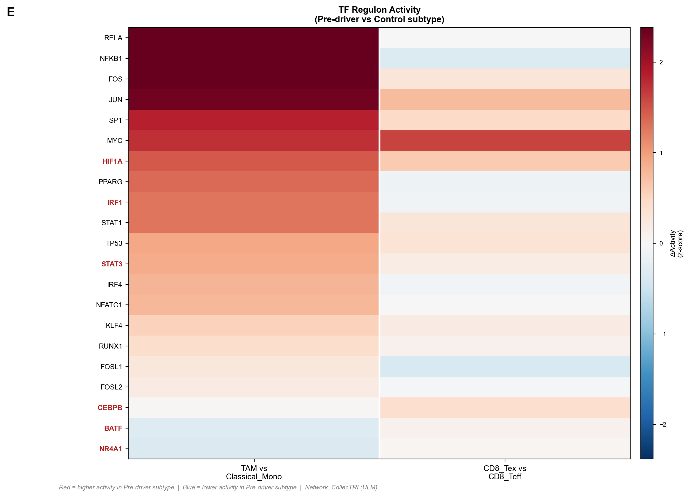

*图（左右两组）：左侧为 TAM vs Classical_Mono，右侧为 CD8_Tex vs CD8_Teff。颜色代表 decoupleR-ULM 推断的 TF 活性 z-score。TAM 中 RELA/NFKB1/IRF1/HIF1A 显著上调；CD8_Tex 中 MYC/JUN/HIF1A 上调，NR4A1/BATF 相对下调。*

---

## 八、综合 Pre-driver 模型

基于拟时序、空间定位、TF 轨迹三部分分析的综合模型：

```
炎症单核细胞（GSE125527，S100A8⁺/IRF4⁺/KLF4⁺）
    拟时序 0–0.25 | JUN/FOS 急性炎症激活
           ↓
    ─────────────────────────────────────
    Pre-driver 窗口（拟时序 0.25–0.35）
    Classical_Mono + Inflam_Mac 混合表型
    FCGR3A/LGMN/RGS1 开始上调
    IRF1/SPI1/NFKB1 上升，IRF4/KLF4/JUN 下降
    ─────────────────────────────────────
           ↓
    拟时序 0.35–1.0 | NFKB1/HIF1A/MYC/IRF1 驱动
           ↓
    终末 TAM（GSE132465，SPP1⁺/APOE⁺/HLA-DRA⁺）
    → 在 CRC 肿瘤边界（Border）大量积聚（35.5% vs Normal 0.5%）
    → 构建物理-免疫双重屏障阻碍 T 细胞浸润
```

**综合潜在治疗靶点（优先级排序）**：

| 靶点 | 证据层次 | 靶向策略 |
|---|---|---|
| **IRF1** | 轨迹 ρ=+0.29（最强），decoupleR Δ=+1.25，TAM 活性最高 | IRF1 抑制剂阻断 Classical_Mono→TAM 转化 |
| **SPI1（PU.1）** | 轨迹 ρ=+0.25，髓系分化核心 TF | 靶向 SPI1 阻断髓系向 TAM 分化 |
| **NFKB1/RELA** | 轨迹上升 + decoupleR TAM Δ=+2.6/+3.1 | NF-κB 通路抑制剂（双靶点）|
| **HIF1A** | 轨迹上升，Border 富集 SPP1⁺TAM | 低氧靶向治疗阻断 Border 积聚 |
| **SPP1** | Border/Tumor 35.5% vs Normal 0.5%，最强空间标志 | SPP1 中和抗体或 SPP1⁺TAM 清除 |

---

## 九、Figure 2 交付汇总

| Panel | 内容 | 文件路径 |
|---|---|---|
| 2A | 髓系拟时序 UMAP（数据集/亚型/拟时序/Pre-driver）| `Trajectory_Analysis/figures/pseudotime_overview` |
| 2B | Pre-driver 轨迹摘要（拟时序×抑制性评分）| `Trajectory_Analysis/figures/predriver_trajectory` |
| 2C | 关键基因 UMAP 表达（8 基因）| `Trajectory_Analysis/figures/gene_expression_umap` |
| 2D | CRC vs UC 命运分支 DEG | `Trajectory_Analysis/figures/branch_DEG` |
| 2E | Pre-driver 区域富集（SPP1+ 比例 + 评分）| `Spatial_Distribution/figures/predriver_enrichment` |
| 2F | 髓系亚型组成（Normal/Border/Tumor）| `Spatial_Distribution/figures/myeloid_subtype_composition` |
| 2G | TF 拟时序 Spearman 相关性 | `SCENIC_Regulon/figures/tf_pseudotime_correlation` |
| 2H | TF 活性热图（亚型）| `SCENIC_Regulon/figures/tf_heatmap_subtype` |
| 2I | TF 趋势曲线（沿拟时序）| `SCENIC_Regulon/figures/tf_trends` |
| 2J | TF UMAP | `SCENIC_Regulon/figures/tf_umap` |
| 2K | TF 末态比较热图（decoupleR）| `Spatial_Distribution/figures/figure2_panelE` |

所有文件均位于 `Project_Delivery/results/Figure2_Pre_driver_Trajectory/` 下，PNG（dpi=200）+ PDF（矢量）双格式。

---

## 十、辅助图 — 细胞亚群 Marker 基因

### Supplementary Figure 2

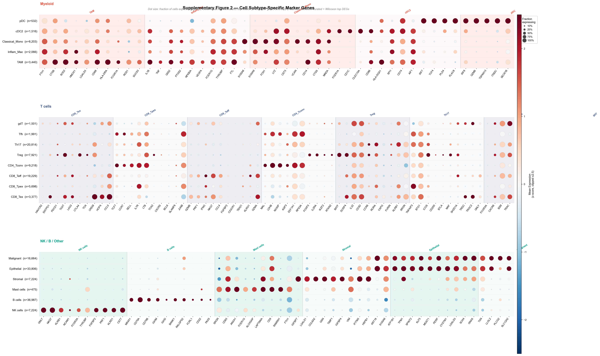

**图注**：所有细胞亚群的特异性 marker 基因 dotplot，按三大谱系分组展示（Myeloid / T cells / NK·B·Other）。每个亚群展示 10 个标志基因，优先选用文献验证核心 marker，不足部分由 Wilcoxon rank_genes_groups 计算结果补充。点大小代表表达比例；颜色代表 z-score 标准化均值表达量（±2.5 截断）。

**关键亚群 Marker 解读**：

| 亚型 | 核心 Marker | 特征 |
|---|---|---|
| **TAM** | APOE, SPP1, FTH1, LGALS3, HLA-DRA | 抗原呈递抑制型 TAM；APOE/SPP1 是肿瘤相关巨噬细胞特征基因 |
| **Inflam_Mac** | IL1B, CXCL8, TNF, PTGS2, NFKBIA | 炎症性巨噬细胞；NF-κB 通路激活，COX-2（PTGS2）高表达 |
| **Classical_Mono** | S100A8/9, FCN1, LYZ, CD14, VCAN | 经典炎症单核细胞；S100A8/9 双阳性为关键特征 |
| **cDC2** | FCER1A, CLEC10A, CD74, SPI1, CPVL | 传统 DC2；MHCII 相关基因，IgE 受体 FCER1A 特异 |
| **pDC** | IRF7, TCF4, PLD4, PLAC8, IRF8 | 浆细胞样 DC；I 型 IFN 产生细胞，IRF7/8 驱动 |
| **CD8_Tex** | HAVCR2, ENTPD1, PDCD1, TIGIT, TOX | 终末耗竭；多抑制受体共表达 |
| **CD8_Tpex** | TCF7, SELL, CCR7, TOX2, CXCR5 | 干性/前耗竭；TCF7+ 维持自我更新 |
| **CD8_Teff** | GZMB, PRF1, IFNG, FGFBP2, TBX21 | 效应/细胞毒；颗粒酶 B + 穿孔素双阳性 |
| **Treg** | FOXP3, IL2RA, IKZF2, RTKN2, LAYN | 调节性 T 细胞；FOXP3+CD25+ 核心特征 |

---

## 十一、阶段二结论

1. **Pre-driver 亚群确立**：TAM（CRC/UC 比 = 75.5×）和 CD8_Tex（13.8×）是 CRC 最特异性的抑制性亚群；在拟时序轨迹中，**2,773 个过渡期细胞（18.9%）**被精确定义为 Pre-driver 候选（拟时序 0.25–0.35，已表达抑制性标志但非终末态）

2. **演化轨迹完整重建**：从 UC 炎症单核细胞（S100A8⁺/IRF4⁺）出发，经 Pre-driver 过渡态（FCGR3A⁺/RGS1⁺），到达 CRC 终末 TAM（SPP1⁺/APOE⁺），轨迹由 **IRF1/SPI1 → NFKB1/HIF1A** 分阶段调控

3. **空间阻断假说成立**：SPP1⁺ TAM 在肿瘤 Border 区 70× 富集（35.5% vs 0.5%），且 Border ≈ Tumor（p=0.47 无差异），支持"Pre-driver 在边界构建物理-免疫双重屏障阻碍 T 细胞渗透"假说

4. **调控轴清晰**：IRF1（轨迹 ρ=+0.29，decoupleR Δ=+1.25）和 NFKB1/RELA（decoupleR Δ=+2.6/+3.1）是 TAM Pre-driver 的核心双轴 TF，HIF1A 介导低氧-Border 富集，SPI1 驱动髓系谱系承诺

### 进入阶段三的基础

| 内容 | 状态 | 阶段三用途 |
|---|---|---|
| Pre-driver 候选细胞列表（2,773 个）| ✅ | MMRp CRC 亚群提取基础 |
| TAM/CD8_Tex 基因 signature（20 基因）| ✅ | GSE178341 MIL 整合特征 |
| 治疗靶点列表（IRF1/SPI1/NFKB1/HIF1A/SPP1）| ✅ | 药物靶点数据库匹配 |
| GSE144735 空间验证数据 | ✅ | 干预响应的空间对照 |

---

*分析工具：scanpy 1.12 / scvi-tools 1.4.1 / Palantir / decoupleR 1.8.0 (CollecTRI)*
*计算环境：Python 3.12, Windows 11, CPU-only*
*交付目录：Project_Delivery/results/Figure2_Pre_driver_Trajectory/*
